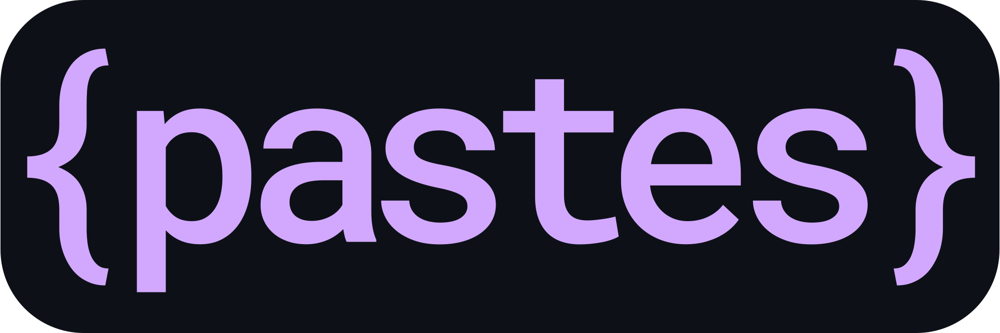

<p align="center">
  
</p>

**paste is a simple web app for writing & sharing code.** It's my own take on conventional pastebin sites like _pastebin.com_ or _hastebin_.

Anyone can use paste! The official/public instance can be accessed using the endpoints listed below, but you can also [host your own](#host-your-own) if you like!

##### 1) In a Web Browser
Just go to https://pastes.dev!

##### 2) From the Command Line
You can submit content most easily using [curl](https://curl.se/docs/manpage.html).

```shell
# Upload the contents of a file
> curl -T example.txt https://api.pastes.dev/post

# Upload the contents of a file and specify the language
> curl -T example.yml -H "Content-Type: text/yaml" https://api.pastes.dev/post

# Pipe in some output from any command
> echo "Hello world" | curl -T - https://api.pastes.dev/post
```

<details>
  <summary>If curl isn't installed on your system, you can also post using <b>netcat</b>.</summary>
  
  ```shell
  # Pipe in some output from any command
  > echo "Hello world" | nc nc.pastes.dev 1337
  
  # Upload the contents of a file
  > cat example.txt | nc nc.pastes.dev 1337
  ```
</details>

<details>
  <summary>If you don't want to do so much typing, you can create a shorter <b>alias</b>.</summary>
  
  ```bash
  # Add this to the end of `~/.bashrc` and run 'source ~/.bashrc'
  paste() {
    curl -T $1 https://api.pastes.dev/post
  }
  ```

  then...

  ```shell
  # Upload the contents of a file
  > paste example.txt

  # Pipe in some output from any command
  > echo "Hello!" | paste -
  ```
</details>

##### 3) From Code
Send GET/POST/PUT requests to `https://api.pastes.dev/`. More info [below](#pastesdev-api).

___

### About
The frontend _(this repository)_ is written using the React framework. The backend data storage is handled by a separate web service called [bytebin](https://github.com/lucko/bytebin).

The user-interface is based on the [Monaco Editor](https://microsoft.github.io/monaco-editor/), the engine behind the popular Visual Studio Code text editor. It's quite simple; it supports syntax highlighting, automatic indentation, many supported languages, themes, zooming in/out, linking to specific lines or sections, and more!

### pastes.dev

I host a public instance at https://pastes.dev. Please feel free to use it to share code/configs/whatever!

Please note that the following (very-non-legally worded) [terms of service](https://github.com/lucko/bytebin#public-instances) apply.   
If you come across any content which is illegal or infringes on copyright, please [get in touch](https://lucko.me/contact) and let me know so I can remove it.

Uploaded content is retained for 90 days then deleted.

### pastes.dev API

* To **read** content, send a HTTP `GET` request to `https://api.pastes.dev/<key>`.
  * Replace `<key>` with the id of the paste.
  * The content is returned in the response body.
  * The `Content-Type` header is `text/<language>`, where language is the id of the language the paste was saved with.
* To **upload** content, send a HTTP `POST` request to `https://api.pastes.dev/post`.
  * Include the content in the request body.
  * Specify the language with the `Content-Type: text/<language>` header, and please provide a `User-Agent` header too.
  * The paste "key" is returned in the `Location` header, or in the response body as a JSON object in the format `{"key": "<key>"}`.

The API is powered by the [bytebin](https://github.com/lucko/bytebin) service, so more information about how it works can be found there.

___

### Host your own

It's quite simple to host your own version.

```bash
git clone https://github.com/lucko/paste
cd paste
yarn install

# Outputs html/css/js files to /build
yarn build

# Start a webserver for testing/development
yarn start
```

You can then follow the [create-react-app deployment documentation](https://create-react-app.dev/docs/deployment/) for how to host the build output. I personally recommend deploying to the cloud using a service like Netlify instead of hosting on your own webserver.

If you really want to self-host (including the bytebin data storage part), I suggest using Docker:

```bash
git clone https://github.com/lucko/paste
docker compose up -d
```

You should then (hopefully!) be able to access the application at `http://localhost:8080/`.
